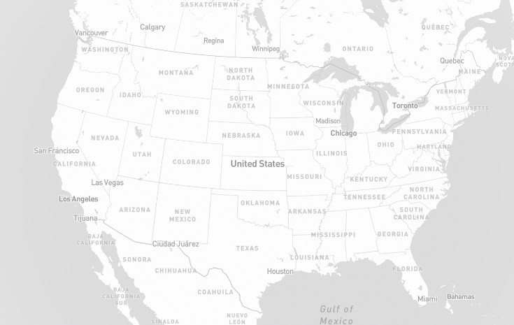
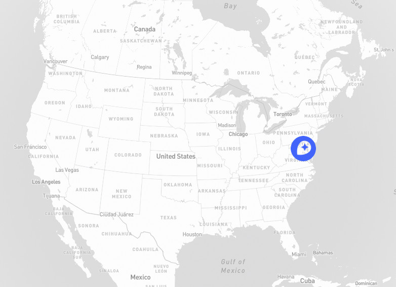

Mapbox [Add custom markers in Mapbox GL JS](https://docs.mapbox.com/help/tutorials/custom-markers-gl-js/) tutorial implementation with Node.js and express HTTP server.

Prepare Node.js project with

```bash
npm init --yes
```

command. Install express with

```bash
npm install express --save
```

command.

Setup HTTP server skeleton code in `app.js` just to serve `index.html` file from disk this way

```js
'use strict'

const express = require('express')
const path = require('path')

const app = express()
const port = 3000

app.get('/', (req, res) => {
	res.sendFile(path.join(__dirname, '/index.html'))
})

app.listen(port, () => {
	console.log(`Example app listening on port ${port}`)
})
```

Now create `index.html` file with following content

```html
<!DOCTYPE html>
<html lang="en">

<head></head>

<body>
Hello World!
</body>

</html>
```

To run skeleton app execute

```bash
node app.js
```

command and open `localhost:3000` in web browser window and you should see

```
Hello World!
```

on the screen.

Next step is to follow [Add custom markers in Mapbox GL JS](https://docs.mapbox.com/help/tutorials/custom-markers-gl-js/) tutorial so

Load Mapbox API and define style for map view in a `<head>` element

```html
<head>
	<meta charset='utf-8' />
	<title>Add custom markers in Mapbox GL JS</title>
	<meta name='viewport' content='width=device-width, initial-scale=1' />
	<link href="https://fonts.googleapis.com/css?family=Open+Sans" rel="stylesheet">
	<script src='https://api.tiles.mapbox.com/mapbox-gl-js/v2.9.2/mapbox-gl.js'></script>
	<link href='https://api.tiles.mapbox.com/mapbox-gl-js/v2.9.2/mapbox-gl.css' rel='stylesheet' />

	<style>
		body {
			margin: 0;
			padding: 0;
		}

		#map {
			position: absolute;
			top: 0;
			bottom: 0;
			width: 100%;
		}

		.marker {
			background-image: url('mapbox-icon.png');
			background-size: cover;
			width: 50px;
			height: 50px;
			border-radius: 50%;
			cursor: pointer;
		}
	</style>
</head>
```

Again run app with

```bash
node app.js
```

command and refresh the web page. This time you should see map view on the screen with *United States* in the middle.



We can move and zoom map (globe) with mouse the standard way. Pretty cool!

The next step is to add marker to the view in GeoJSON format so define `geojson` object

```js
const geojson = {
	type: 'FeatureCollection',
	features: [{
		type: 'Feature',
		geometry: {
			type: 'Point',
			coordinates: [-77.032, 38.913]
		},
		properties: {
			title: 'Mapbox',
			description: 'Washington, D.C.'
		}
	}]
}
```

add marker style bellow `#map` sytle in a `head/style` element. 

Next add `for` cycle to create `<div>` DOM element for each marker in a `geojson` variable (we have just one there).

```js
// add markers to map
for (const feature of geojson.features) {
	// create a HTML element for each feature
	const el = document.createElement('div');
	el.className = 'marker';

	// make a marker for each feature and add to the map
	new mapboxgl.Marker(el).setLngLat(feature.geometry.coordinates).addTo(map);
}
```

See `.marker` style reffers to `mapbox-icon.png` so in a project directory create `public` directory and copy `mapbox-icon.png` file in it. Now we need to tell express to care `public` directory with

```js
app.use(express.static(path.join(__dirname, '/public')));
```

line just after `app.get('/', ... )` function call.

Again run app with

```bash
node app.js
```

command and refresh the web page. This time you should see marker placed over *Washington, D.C.* position on map view.



In the next article I will show how to dynamically update cursor position in the map.

See you soon.

